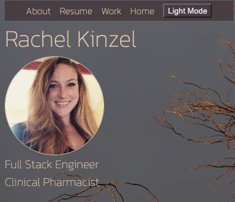

# Rachel Kinzel Portfolio

Welcome to my portfolio! Explore my works, resume, and get to know me!

## Getting started: 
* [Check out the app!](https://rachelkinzel-portfolio.netlify.app/)
* [Trello Planning]( https://trello.com/b/DctlU2a6/rachel-kinzels-portfolio)

## Technologies: 

## Credits
* Sourced icons from [Ion Icons](https://ionic.io/ionicons) and [SVG Icons](https://www.svgrepo.com/)
* Sourced card from [Bootstrap](https://getbootstrap.com/docs/4.0/components/card/)
* Sourced light/dark toggle code from [Youtube](https://www.youtube.com/watch?v=W8vzyFFia6Q&list=PL2Kp3FX7ViJhG0pEPC-ysHuQEV_KdQItr&index=42&t=1600s)

## Next steps: 
* Add email form for users
* Improve UI 

