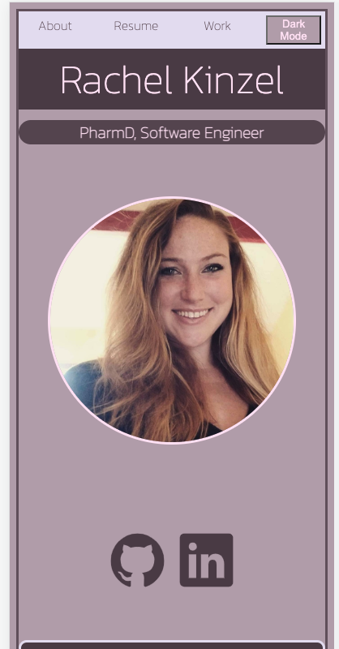

# Portfolio

Rachel Kinzel's Portfolio

Rachel's portfolio is a page with 3 sections dedicated to professional journey and skills. The user can click the contact icons to view Github and LinkedIn profiles. The user can also 'jump' to sections by clicking the links on the navigation bar. In the 'Work' section, the user is able to view the deployable link for 'Tic Tac To' and the Github repository associated with it. 

Getting started: https://rachelkinzel-portfolio.netlify.app/
                 https://trello.com/b/DctlU2a6/rachel-kinzels-portfolio

Technologies: Javascript, HTML, CSS
Sourced icons from: https://ionic.io/ionicons
Sourced card from:  https://getbootstrap.com/docs/4.0/components/card/

Next steps: improve user interacivity experience, seperate each section into a different web page, add more responsive design to better utilize space and content. 
